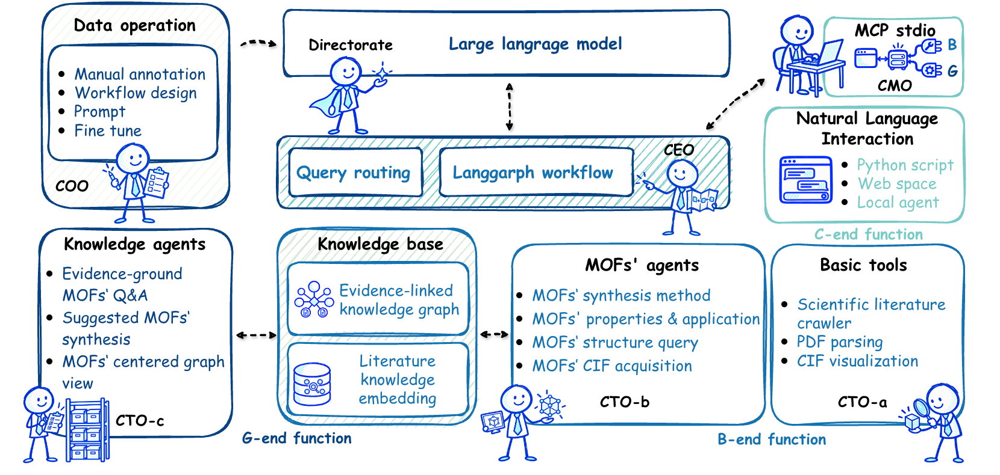
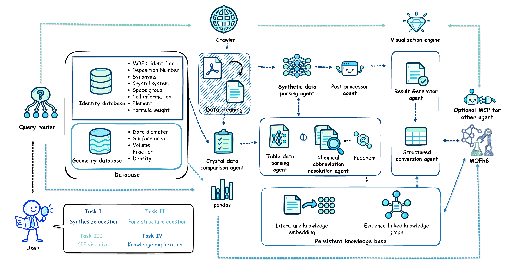

#  MOFh6

From the challenge of sifting through vast, ambiguous MOF literature to the clarity of structured, actionable data, **MOFh6** emerges as the solution. It is an intelligent, multi-agent system that transforms unstructured scientific text on metal–organic frameworks (MOFs) into analysis-ready synthesis and property data. By combining large language models (LLMs) with rule-based agents, MOFh6 delivers high-accuracy, cost-efficient extraction, enabling scalable, data-driven materials discovery.

MOFh6 operates within an **enterprise-inspired framework**, where each role mirrors a corporate function:

- **CEO** – Responsible for central coordination, leveraging the Langgraph framework to orchestrate all agents and tools.  
- **CMO** – Oversees data management and user interaction, ensuring a smooth and accessible user experience.  
- **COO** – Comprising human experts, focuses on data annotation and workflow design for high-quality inputs.  
- **CTO** – Constituted by LLM agents, leads the integration and deployment of core technological capabilities.


# Script architecture

```markdwon
📁 MOFh6
├── 📁 datareading
├── 📁 extrfinetune
│   ├── cftm.py
│   ├── chl.py
│   ├── cjtj.py
│   ├── cstrucout.py
│   ├── ctotable.py
│   └── 📁 prompt
│       ├── elsedatatable.py
│       ├── elsehl.py
│       ├── jtjprompt.py
│       └── sstru1.py
├── 📁 icon
├── 📁 knowledge
│   ├── store.py
│   ├── ingest.py
│   ├── chemical_resolver.py
│   ├── pubchem_resolver.py
│   ├── similarity.py
│   └── ingredient_qa.py
├── 📁 rag
│   └── engine.py
├── main.py
├── mcp_server.py
├── mcp_worker.py
├── mcp-requirements.txt
├── 📁 refer
│   ├── ACS_crawler.py
│   ├── Elsevier_crawler.py
│   ├── RSC_crawler.py
│   ├── Springer_crawler.py
│   └── Wiley_crawler.py
├── 📁 request
│   ├── 📁 config
│   │   └── config.py
│   ├── 📁 core
│   │   ├── data_processor.py
│   │   ├── query_parser.py
│   │   └── query_system.py
│   ├── main.py
│   ├── 📁 prompt
│   │   └── query.py
│   └── 📁 utils
│       ├── constants.py
│       ├── pdf_processor.py
│       ├── rdoi.py
│       ├── re_cif.py
│       └── vis_cif.py
└── 📁 ulanggraph
    ├── data_processorllm.py
    ├── file_processor.py
    ├── main.py
    ├── knowledge_viewer.py
    ├── 📁 prompt
    │   └── totext.py
    ├── workflow_core.py
    └── workflow_manager.py
```

# folder&script function
## Core Tasks of MOFh6

I. **Synthesis Extraction** – Retrieve detailed synthesis descriptions for specified MOFs.  
II. **Pore Structure Analysis** – Obtain pore structure parameters for the target MOFs.  
III. **Structure Visualization** – Generate visual representations of the specified MOFs.  
IV. **Knowledge Exploration** – Query indexed literature, inspect evidence-linked graphs, and compare published synthesis cases.



## New Knowledge and Literature Features

MOFh6 now accumulates literature and structured workflow outputs in a persistent SQLite knowledge base at `ulanggraph/output/knowledge/mofh6.db`. The following capabilities extend the original three core tasks:

- **Literature embeddings and hybrid RAG** – Imported paper text is split into page-aware chunks and embedded with `text-embedding-3-small`. Retrieval combines embedding similarity, BM25, TF-IDF, and material identifiers. Unchanged chunks reuse stored vectors; missing vectors can be backfilled. Answers retain links to the retrieved sources.
- **Evidence-linked knowledge graph** – Materials, synthesis recipes, chemicals, equipment, crystal observations, papers, and supporting text are connected through incremental imports. The graph can be inspected as records, summarized in natural language, or explored in an interactive HTML visualization.
- **Similar published synthesis cases** – Chemical identity and reported synthesis conditions support explainable comparisons between MOFs. Optional PubChem lookup recognizes uniquely resolved chemical aliases using CID and InChIKey, with results cached locally. Recommendations summarize published cases rather than predicting reaction products or synthesis success.
- **Natural-language reagent lookup** – An LLM distinguishes questions about named MOFs from questions that supply starting reagents. Explicitly mentioned chemicals are matched against indexed synthesis recipes, and supporting text is retrieved from each candidate's own paper.
- **Follow-up questions and suggestions** – Questions about an indexed material can enter RAG without a command prefix. Follow-up questions use the active material context, and answerable question suggestions are checked against available evidence.
- **Local MCP tools** – MCP-compatible clients can download papers, process PDFs, run the extraction workflow, and ask MOFh6 questions through the existing application.

### Try the new features

Enter these commands at the `Query>` prompt after starting `main.py`:

```text
rag ingest ./ulanggraph/input
graph stats
graph show ADAXEK
graph similar ADAXEK
graph recommend ADAXEK
What synthesis conditions were reported for ADAXEK?
What about its stability?
suggest questions ADAXEK
clear context
I have cobalt nitrate and terephthalic acid; which reported MOF cases use them?
```

Use a material present in your own knowledge base. `rag ask <question>` explicitly selects literature RAG, while `graph update <md/json>` imports a structured workflow artifact. Results depend on the indexed evidence and may be unavailable for materials or reagent combinations that have not been imported.

Inspect the database without starting the conversational application:

```bash
python ulanggraph/knowledge_viewer.py stats
python ulanggraph/knowledge_viewer.py documents --limit 5
python ulanggraph/knowledge_viewer.py search "ADAXEK synthesis conditions" --top-k 5
python ulanggraph/knowledge_viewer.py visualize
```

### datareading
- The core meta data of MOFh6, click on [📁 datareading](https://github.com/lzhzzzzwill/MOFh6/tree/main/datareading) to learn more.
  - COO – Focuses on data annotation and workflow design. All COO-curated and annotated datasets are stored in the [💾 MOFh6test](https://github.com/rendaoyuan/MOFh6test) repository.

### extrfinetune
- CTO – Comprising MOFh6’s core LLM agent, is primarily responsible for Task I, which involves extracting synthesis information of specified MOFs from full-length scientific literature,
click on [📁 extrfinetune](https://github.com/lzhzzzzwill/MOFh6/tree/main/extrfinetune) to learn more.

### refer
- Retrieving scientific literature through compliance-driven data-mining scripts to supply source material for the MOFh6 workflow,
click on [📁 refer](https://github.com/lzhzzzzwill/MOFh6/tree/main/refer) to learn more.

### request
- CTO – Comprising MOFh6’s core LLM agent, is primarily responsible for Task II and Task III, delivering pore structure parameters of specified MOFs and enabling in-depth structural exploration within MOFh6.

### ulanggraph
- CEO appointed by LangGraph to coordinate and manage the execution of all agents and tools.
- Completing a structured workflow also incrementally imports its synthesis and crystallographic outputs into the persistent knowledge graph.

### knowledge and rag

- [📁 knowledge](https://github.com/lzhzzzzwill/MOFh6/tree/main/knowledge) stores graph records and provenance, imports structured artifacts, resolves chemical identities, and compares published synthesis cases.
- [📁 rag](https://github.com/lzhzzzzwill/MOFh6/tree/main/rag) manages text chunks, embeddings, hybrid retrieval, evidence-grounded answers, and question suggestions.

### MCP integration

- Install `mcp-requirements.txt` alongside the main dependencies and configure your MCP client to launch `python /absolute/path/to/MOFh6/mcp_server.py` using the same Python environment as MOFh6. The local stdio server provides `download_mof_paper`, `process_mof_pdf`, `run_mof_workflow`, and `ask_mof`.

### [📜 main.py](https://github.com/lzhzzzzwill/MOFh6/blob/main/main.py)
- CMO – Oversees data management and user interaction. To run MOFh6 locally, users should review the folder&script function above to configure the environment correctly.
  - MOFh6 is developed and tested on MacOS M2. To run on Windows, only minor adjustments in [📁 refer](https://github.com/lzhzzzzwill/MOFh6/tree/main/refer) are needed.

```bash
# Python environment
# Recommended: Python 3.10
# Install dependencies

git clone https://github.com/lzhzzzzwill/MOFh6.git
cd MOFh6
pip install -r requirements.txt
python main.py
```

The local files `extrfinetune/config.json` and `datareading/des_mate.json` are excluded from Git. Supply your own configuration with `openaiapikey` and `xlsx_path`, and place the required material metadata at `datareading/des_mate.json` before running workflows that use it. Configuration and data files remain on your own machine.

- For quick access without local configuration, the CMO also provides an online [💻 app](https://huggingface.co/spaces/Willlzh/MOFh6), enabling immediate use in any syste without installation.


## 📄 Copyright Registration
This software has been registered with the National Copyright Administration of China.  
Registration No.: **2025SR1621800**.
